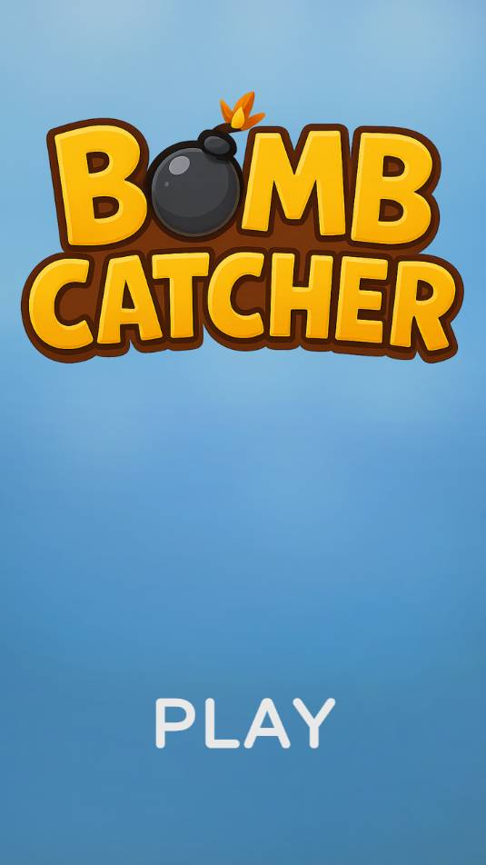
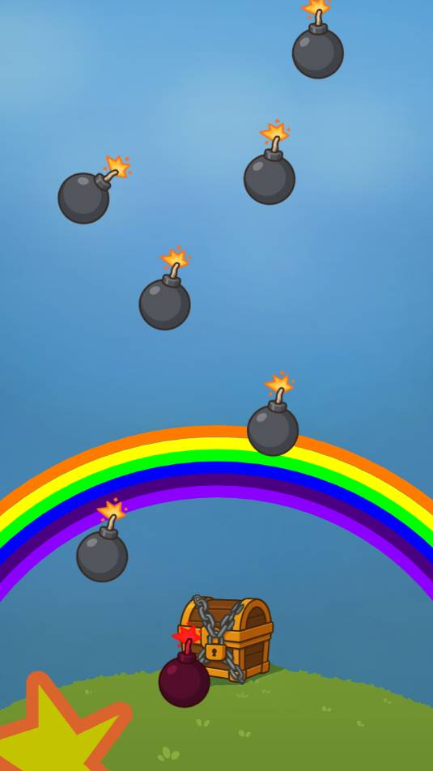
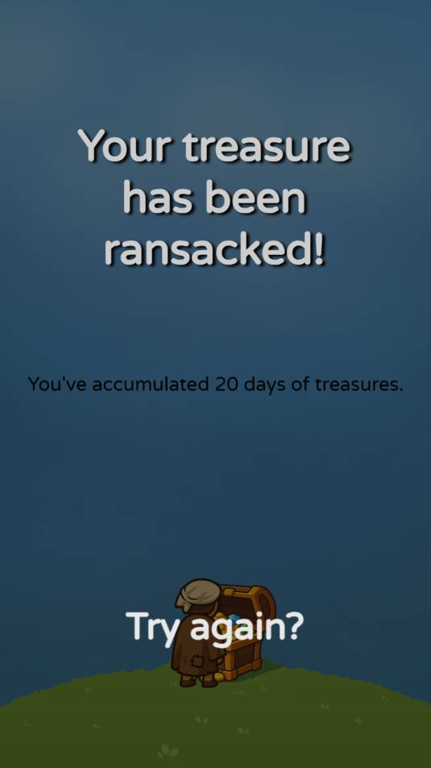
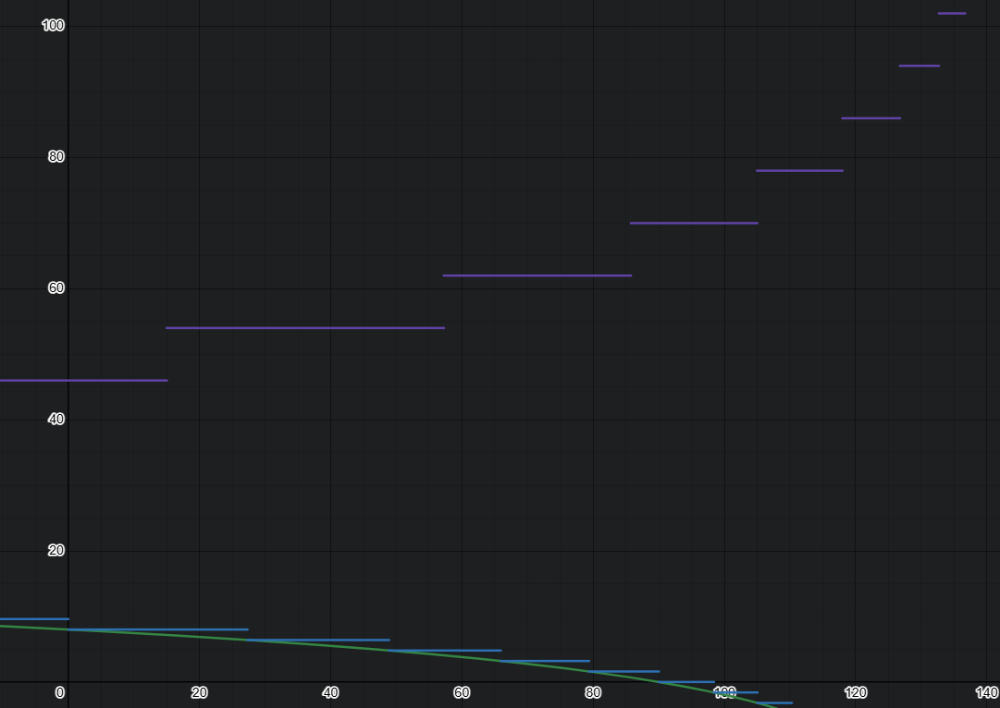

# Bomb catcher

## Instructions du test

### Pitch
Des bombes tombent et votre rôle est de les attraper avant qu’elles explosent au sol. Comme les chats, vous avez 9 vies.

### Mécanique
Des bombes tombent du haut vers le bas. Il doit y avoir un angle de chute aléatoire pour ajouter de la diversité.
Le joueur doit cliquer sur les bombes pour les attraper.
Si une bombe atteint le bas de l’écran, elle explose et le joueur perd une vie.
Quand il a perdu ses 9 vies, la partie s’arrête et le jeu affiche le score. Et permet de lancer une nouvelle partie.
La difficulté augmente avec le temps :
Jouer sur la vitesse de chute
Jouer sur le nombre de bombes

## Durée de travail

Commencé dimanche matin, 06 avril 2025.

Fait en ~20h, 3 jours. Un peu près autant de temps sur l'art/gd que sur la programmation.

## Jouer

https://ambroise-rabier.dev/bomb-catcher/

Ou

```shell
npm i
npm run start
```


## GD

### Mobile

Choix d'un format portrait

### Joueur cible

Des devs JV, donc des joueurs confirmés.
La difficulté étant par conséquent plutôt élevée pour un joueur moyen.
Ce projet étant un test, le temps de jeu est prévu pour être très court (1-2min).

### Difficulté

La vitesse et la quantité de bombe augmente selon une courbe type exponentielle.
En violet la quantité de bombe par minute, en bleu la durée que prend la bombe pour tomber du ciel au sol en seconde.
On commence donc à 46 bombes par minute et 8 secondes en "vitesse".



Les bombes une apparition aléatoire en haut de l'écran à travers un algo d'aléatoire contrôlé afin d'éviter que trop
de bombes apparaissent au même endroit à la suite.

### Score

Le score correspond au temps survécu en secondes.


### Feedbacks

Changement de difficulté: Le passage de l'avion indique une augmentation de la difficulté, 
gauche ou droite selon si c'est la vitesse ou la quantité de bombe qui change.

Temps de jeu et score: Le passage des avions permet au joueur de se repérer dans le temps sans avoir
à afficher des chiffres.

Vies restantes: Afin d'éviter d'afficher des chiffres et nourrir le thème, des arc-en-ciels (7 couleurs) 
combiné à 3 états du coffre permettent d'afficher 9 vies de manière plus subtile.

### Problèmes connues

L'avion donne envie d'être cliqué, il pourrait être remplacé par un changement
dans le background, par exemple des trébuchets apparaissant sur les collines, ce
qui serait en plus moins anachronique. Mais plus long en GA.

## GA

Le thème est facilement reconnaissable, le coffre sous l'arc-en-ciel...

Une grosse quantité de transition ont été implémenté à travers GSAP.
Les assets sont partiellement généré à travers l'IA, puis retravailler sur Krita. (objectif prototype, POC, sans GA dans la team).
Il s'est avéré que ChatGPT donnait le meilleur résultat.

Des placeholders fait à la main très rapidement on été utilisé en début de développement.

On retrouve le travail GA dans le dossier `gameart`.

Krita et TexturePacker ont été utilisé pour les sprite sheets.

Le processus mérite peaufinage, l'idéal étant que en un click de Krita et de TexturePacker on puisse mettre à jour tous assets.


## Améliorations possible

Note importante: Les instructions précisent de ne pas implémenter de "bonus" en game design.

Prog:
- Un éditeur visuel pour définir le placement initial des assets réduirait considérablement
  la quantité de code à lire.

Perf:
- Pooling non implementé

Visuel et feedback:
- Trail renderer sur la bombe.
- Triangle rouge avec point d'exclamation pour annoncer une bombe arrivante.
- Nuages pour réduire la visibilité et détourner l'attention.
- Explosions et bombes animés.
- Background changeant indiquant une augmentation de la difficulté,
  càd remplacer les avions anachronique par des trébuchets sur des collines en fond (siège médiévale).
- Des lutins qui remplissent le trésor.
- Ombre au sol grossissant, indiquant la proximité de la bombe avec le sol.

GD:
- Des trèfles à 4 feuilles comme power-up à clicker en bas. (Travail sur l'attention du joueur)
- Des voleurs à attraper au sol.
- Des choses moins originales, générique :
  - Variation dans le type de bombes. (taille, trajet, division sur click, deux clicks, bomb à ne pas clicker, etc)
  - Niveaux ou points de sauvegarde.
- L'arc-en-ciel sert de bouclier et bloque les bombes (idée initiale de l'arc-en-ciel).

GA:
- Génération des assets plus facile, en deux click.


## Programmation

Basé sur un template utilisant Tauri pour faire un build desktop: https://github.com/ambroiseRabier/pixijs-webpack-ts-starter.
Approche fonctionnelle influencée par mon utilisation de React et mon expérience en development Typescript.
Une approche fonctionnelle, veut dire, pas d'utilisation de classes, de singleton, ou de function anonyme auto-appelé.
Apporté une approche fonctionnelle à un jeu reste nouveau pour moi et j'ai plus ou moins respecté une convention que je me
suis donné de préfixer avec "use" les functions qui serait des classes en OOP. Peut-être que une simple convention en CamelCase
comme pour les components en React serait préférable.

Il y a deux exemples d'utilisation de spritesheet, fait avec Texture packer et Krita.

Un exemple d'utilisation de filtre (`ShockwaveFilter`).

Le chemin des assets est définie dans `assets.ts`.

Les assets utilisés sont définie par chaque écran (game/menu), approche modulaire.

`settings.ts` regroupe des paramètre à destination des GD.

`text-style.ts` est une ébauche pour regrouper les styles de textes, l'approche actuelle n'étant pas idéale.

Une ébauche de gestion d'état (state machine) a été fait. 

### Historique git

Au cas où cela n'irait pas de soi pour le lecteur, 
je laisse volontairement les commits "WIP" afin de montrer la progression 
et que cela n'a pas été généré avec de l'IA.
De plus le projet étant solo de A à Z, je traite la branche main comme une branche feature que je squash-erais avant de la 
partager.
Il est tout à fait possible de séparer chaque changement dans son propre commit avec explication riche et complète de chaque
mouvement, mais cela prendrait du temps.
Quand j'ai plusieurs actions en un commit, je mets une liste commençant par `-`.


## License

This work is provided with **All Rights Reserved** protections for evaluation purposes only as part of a hiring process.  
It may not be used, distributed, or implemented without explicit consent from the author.

See the [LICENSE](./LICENSE) file for more details.
